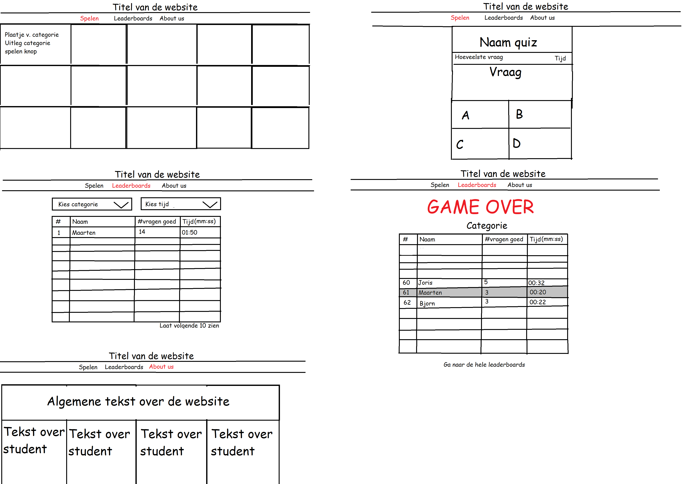

# Trivia-WebIK06

# Projectvoorstel groep IK06
## Samenvatting
Gebruikers kunnen hun naam invoeren en een categorie kiezen en daarna start de quiz. De vragen lopen op in moeilijkheid. Het is ook mogelijk om alle categorieën te kiezen voor een extra uitdaging. Indien er een vraag fout is dan zal de quiz stoppen en wordt het aantal goede vragen en de tijd op het scorebord van de desbetreffende categorie gezet. Er zit een tijdslimiet per vraag aan verbonden. De tijd wordt als tiebreaker gebruikt.

## Schetsen
De schetsen worden nog toegevoegd als bijlage.

## Features
### De gebruiker kan:
1. **een naam invullen;**
2. een van de categorieën kiezen;
3. **vragen beantwoorden totdat een fout antwoord wordt gegeven;**
4. **de scoreborden per categorie bekijken;**
5. meer informatie over de website lezen.

### Overig
1. Vragen lopen op in moeilijkheid;
2. **Vragen komen uit een online database met goed gereviewde multiple-choice vragen;**
3. **De website moet er netjes uitzien en goed werken op kleine schermen (met name smartphones);**
4. Na een correcte vraag wordt de nieuwe vraag getoond zonder de pagina te refreshen;
5. Er worden geluidseffecten of muziek afgespeeld tijdens het spel.

De onderdelen die bij het minimum viable product horen zijn **dikgedrukt**.

## Afhankelijkheden
### Databronnen
- Trivia database met categorieën: https://opentdb.com/;

### Externe componenten
- Bootstrap 4;
- Flask;
- SQLAlchemy;
- JQuery.

### Concurrerende website
- https://www.sporcle.com/ (Redelijk onoverzichtelijk);
- https://www.triviaplaza.com/ (categorieindeling zoals wij die ook willen doen in grid vorm, niet voor mobiel);
- https://www.jetpunk.com/ (Groot aanbod aan quizzes).

### Moeilijkste delen
- Timing;
- Oplopende moeilijkheid van vragen;
- Live updaten.

### Views

Doen: maak een nieuwe schets van je applicatie, waarin alle schermen uitgetekend zijn. Het doel is om snel een goed overzicht van de hele applicatie te krijgen.
Zorg dus dat je schermen die bij elkaar horen ook groepeert. En laat met pijlen zien als een knop doorlinkt naar een ander scherm.

### Models/ helpers

